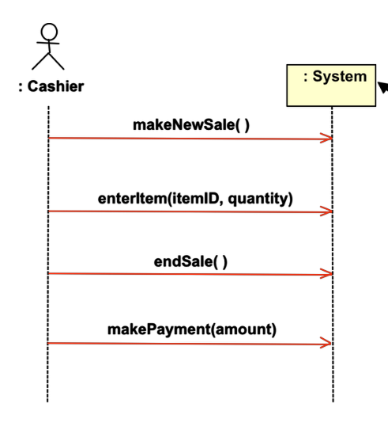

# System Sequence Diagram

Een snel en gemakkelijk te maken diagram wat de input en output gebeurtenissen illustreert.

- Sequence Diagram syntax
- Deel van de Requirements/analyse

De _system events_ beschreven in een usecase diagram zullen hier terug komen. Vaak dient het als startpunt wanneer
het gaat over het design. Dit is eenmaal waar de interactie begint.

## Black box
Een SSD weergeeft alleen de _events_ die gegeneerd worden door een externe actor. Het systeem wordt gezien als een 
_black box_. De interne details zijn weggelaten. We weten dus niet wat het systeem met een _event_ doet. 

## Scenario's 
Een SSD laat enkel één scenario zien van een usecase. Er kunnen dus meerdere bestaan voor dezelfde usecase.

Het is geadviseerd om SSD's te maken voor de meeste gebruikte scenario's.

