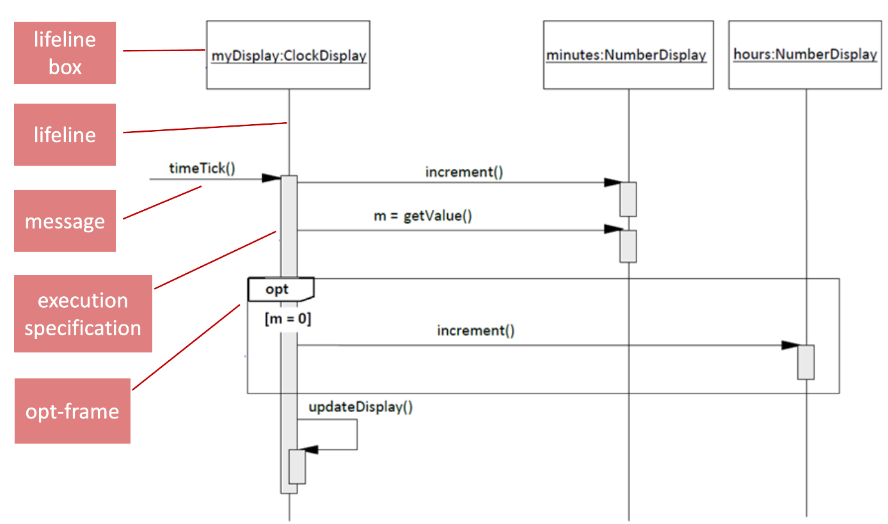
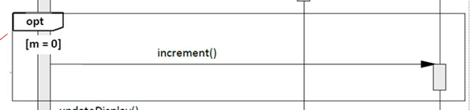

# Sequence Diagrams

white-box

Een sequence diagram is een specialisatie van (de generalisatie) _interaction diagram_. 

een SD geeft weer hoe objecten (binnen het systeem) met elkaar interacteren, welke berichten sturen ze naar elkaar, en
hoe.

## System operation message
Het eerste _message_ binnen het diagram. Hier begint de flow.

## Lifeline box
Representeert een instantie van een object.

| Inhoud         | Betekenis                                                                                                           |
|----------------|---------------------------------------------------------------------------------------------------------------------|
| : Sale         | Representeert een (naamloze) instantie van de klasse _Sale_                                                         |
| sale : Sale    | Representeert een instantie van de klasse _Sale_ met de naam _sale_                                                 |
| sales[i] :Sale | Representeert een instantie van de klasse _Sale_ uit de collectie _sales_, vermoedelijk staat hierom een loop frame |

## Message Syntax

Voorbeelden met steeds hogere specificatie:

### Zonder return waarde
`initialize`
`initialize(code)`  

### Met return waarde
`description = getProductDescription(id)`
`description = getProductDescription(id: ItemId)`
`description = getProductDescription(id: ItemId): ProductDescription`

## Lifeline
dash of solid.

Geeft aan dat een exection specification bij de instantie in de verbonden lifeline box hoort.

Niet nodig om einde neer te zetten. We programmeren in Java, het is garbage collected.

## Execution Specification / Activation Bar
Een representatie van de periode van tijd waarin het object een specifieke actie wordt uitgevoerd, de levensduur
van een methode.

## Frames
Design frames are constructs to support special operations, such as looping and conditionals.

| Frame Operator | Meaning                      | Java Equivalent             |
|----------------|------------------------------|-----------------------------|
| opt            | An optional                  | `if (condition) {}`         |
| alt            | mutual exclusive conditional | `if (condition) {} else {}` |
| loop           | Loop                         | `for (condition) {}`        |