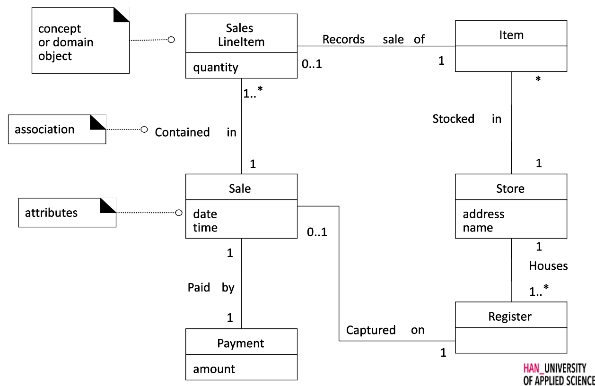

# Domain Model
Een illustratie van _belangrijke_ concepten binnen het domein. 

Gebruikt syntax van een class diagram.

## Concepts / Conceptuele Klasse
Een concept uit de echte wereld

## Association
Een relatie tussen concepten.

### Multipliciteit
Zowel bij een normale en aggregatie associaties wordt een multipliciteit verwacht

### Generalisatie/Specialisatie, aggregatie en compositie
Zie uitleg class-diagrams.

## Attributes
Eigenschappen van concepten.

### Afleidbaar
Afleidbare attributen worden aangegeven met een `/`. zoals `/ quantity`.