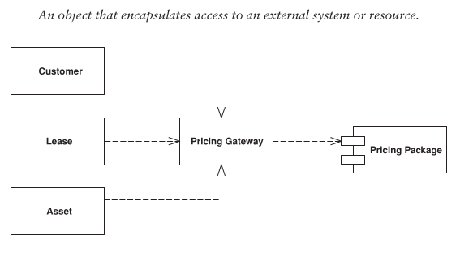

# Gateway

When accessing external resources, you'll usually interact with APIs for them.
These APIs can be somewhat complicated. This makes the software harder to understand, and harder to change.

That's what the _Gateway_ solves, it wraps around the API, to make the system more maintainable and easier to test. 
Any change in the resource will only mean changes in the Gateway class.

## Differences to other patterns
The _Gateway_ may sound fairly similar to certain patterns, namely:

### Facade
The difference is that a _Facade_ usually simplifies an internal service interface. A _Gateway_ is written a specific
use of an external resource. 

In some cases the _Gateway_ will even copy the whole _Facade_ interface of the external interface.

### Adapter
An _Adapter_ makes sure an incompatible interface will match the needed interface. Like mentioned again, it could be 
possible to copy the whole external interface into the _Gateway_. This means it's possible there is not adapting being 
done.

## When to apply?
Consider it whenever you have an awkward interface to something that feels external. Contain the awkwardness inside a 
_Gateway_ class.