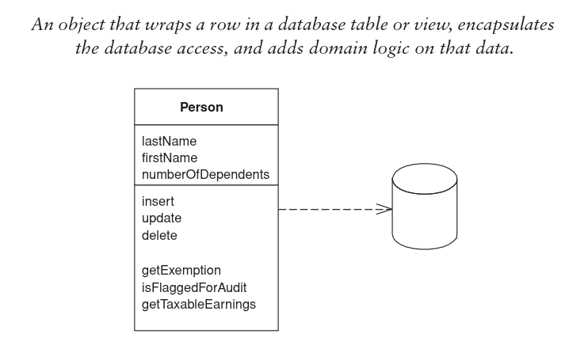

# Active Record

An object both with data and behavior. The most obvious approach. 

Only possible if the structure is very close to its relational counterpart. For that reason
it's best to only use this pattern for simple domain logic.