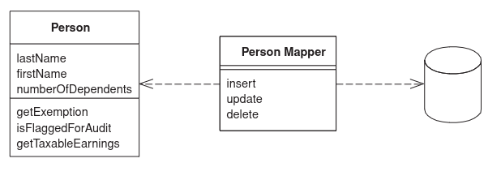

# Data Mapper

The structure of data inside objects is different, from those in relational database.

The _Data Mapepr_ is a layer that separates the in-memory objects from the database. It's
sole responsibility is to transfer data between the two worlds. 