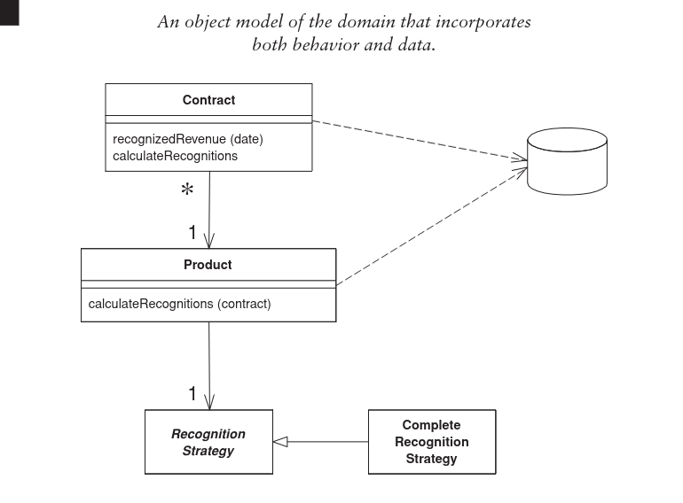

# Domain Model Pattern

A Domain Model creates a web of interconnected objects, where each object represents a part of
the business logic.

You'll find objects that mimic the data in the business, and objects that capture the rules the 
business uses. The data and process are combined; _Information Expert_. 

It often looks quite similar to a relational database model.

It handles complex logic well by breaking it down into small, encapsulated objects.

## Pros
- Easy to modify over time.
- Flexibility

## Cons
- Harder to implement correctly
- More overhead compared to a TS.