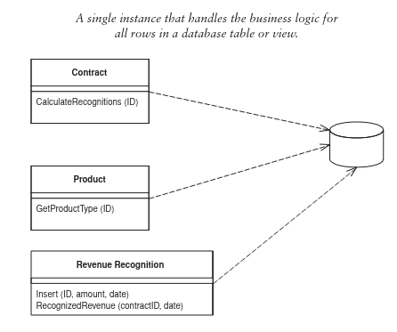

# Table Module (Pattern)

A Table Module will have one object instance to handle all orders. An effect of this is that
a reference has to be passed to every function that wants to operate on that row in the database.

A Table Module works well with table-oriented data, as the name suggests.

## Pros
- You can package the data and behavior will still easily use a relational database

## Cons
- Doesn't give the full power of objects in organizing complex logic
