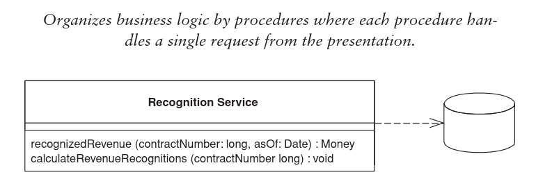

# Transaction Script Pattern

**The simplest approach to storing domain logic.**

**A single procedure for each action**. We can think of it as a script for every action, a business transaction. This does
not mean it has to be a single inline procedure of code.

The procedure contains all the required business logic (that may be in subroutines) and makes calls to
the database (or small wrapper).

## Pros 
- Simple to use.
- little overhead

## Cons
- Duplication: It's relatively easy to implement duplication.