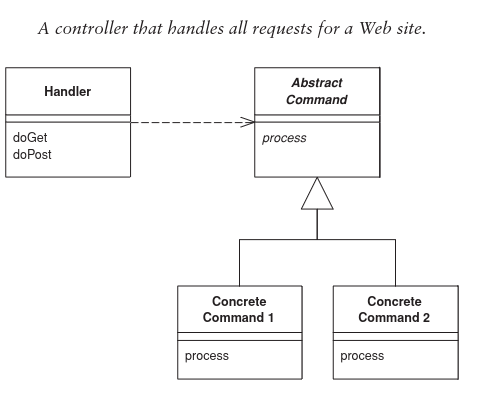
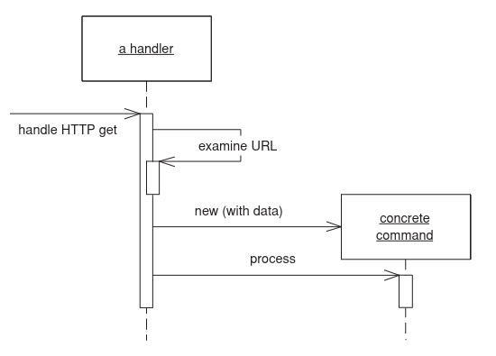

# Front Controller

A modern contemporary website does a lot of similar things when handling a request. To prevent duplication
one could choose to use the front-controller pattern.

The front controller handles all calls to a website.

## When to apply?
The Page Controller is easier to implement. Advantages of a front controller are:
- Easier to prevent duplication
  - Using the Decorator pattern e.g.
- Follows the Open/Closed principle. You can easily add new endpoints without having to change existing code.
- Easier to port to a different web server.
