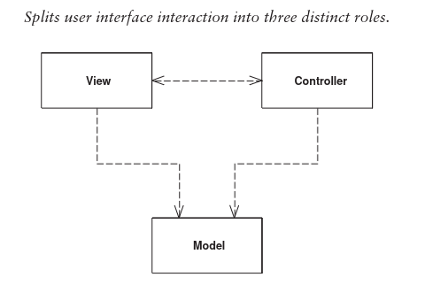

# Model View Controller

MVC consists of three roles.

## Roles
### Model
Represents some information about the domain. It's a nonvisual object. In the most pure form it could
be a selected object mentioned in a domain model.

Example: Data of a customer; A Customer

The Model should be totally unaware of what presentation is being used, the presentation depends on the model,
not the other way around.

### View
Represents solely the display of the model in the UI.

Example: HTML Page showing a customer's info; A UI of the model

### Controller
The controller takes user input, manipulates the model, and causes the view to update appropriately. So a
controller controls the model and view.

## Separations
### Presentation from the model
1. The most important one. They are so different, that different people specialize in one or the other. Although
that obstacle has mostly disappeared in recent years.
2. Users may want to see the same model (information) in different ways. Users may interact with your apps through
two different web interfaces, command-line interface and more.
3. Nonvisual objects are usually easier to test. By separating this you can thoroughly test your domain logic.

### Controller form the view
Less important. Usually a view has only one controller.

## When to apply?
Basically always. It promotes maintainability and extensibility.