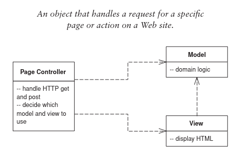

# Page Controller

The idea is to have one module that acts as a controller for each page (or action) on a website. 

## Controller Responsibilities
- Decode the URL and extract any data from the request; preparing the data for the action.
- Create/invoke model objects needed to process the data.
- Determine which view should display the result.

## When to apply?
Promotes a natural structure of handling actions. 

Works well in a site where most of the controller logic is pretty straight-forward.