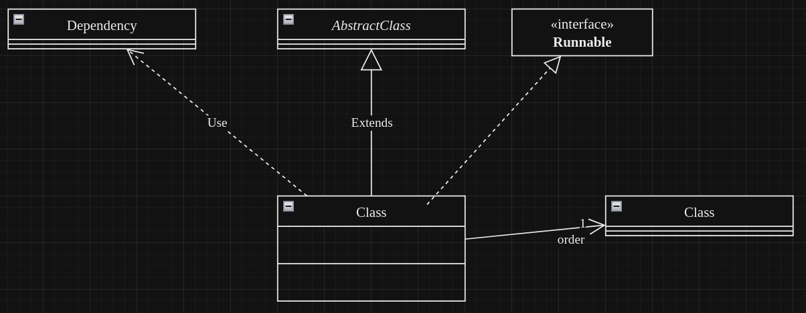
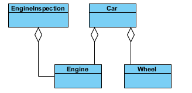
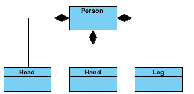

# Class Diagram
## Syntax
### Objects en associaties

### Attributes & Methods
`+ attributeOrMethod` public visibility  
`- attributeOrMethod` private visibility  
`# attributeOrMethod` protected visibility  
`~ attributeOrMethod` package-private visibility  
<u>staticAttributeOrMethod</u>  
<em>abstractAttributeOrMethod</em>

### Attributes Specific
`attributeWithDefault : Bool = true`  
`finalAttribute {readOnly}`

### Methods Specific
`<<constructor>> Class()` 
`MethodWithParams(paramOne: String, paramTwo: int)`  
`MethodWithReturn(): bool`  
`MethodTrowsException() {exception IOException}`
`finalMethod {leaf}`

## Compositie and Aggregatie
### Aggregatie

Suggereert _whole-part_ associatie.

Advies is om dit type relatie eigenlijk te verwijderen.

### Compositie

Een sterke _whole-part_ associatie. Voor compositie moet gelden:
- een _part_ instance kan alleen deel zijn van 1 _compositie_ instantie.
- de _composite_ instantie heeft als enige verantwoordelijkheid om de bijhorende _part_ 
instanties te beheren.
