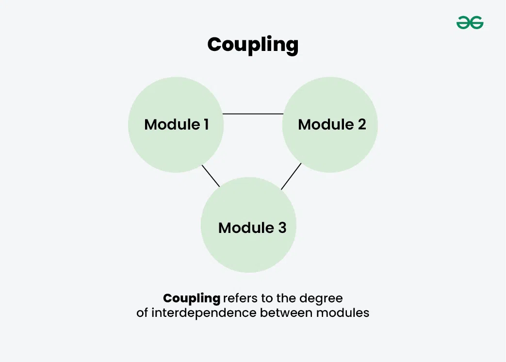
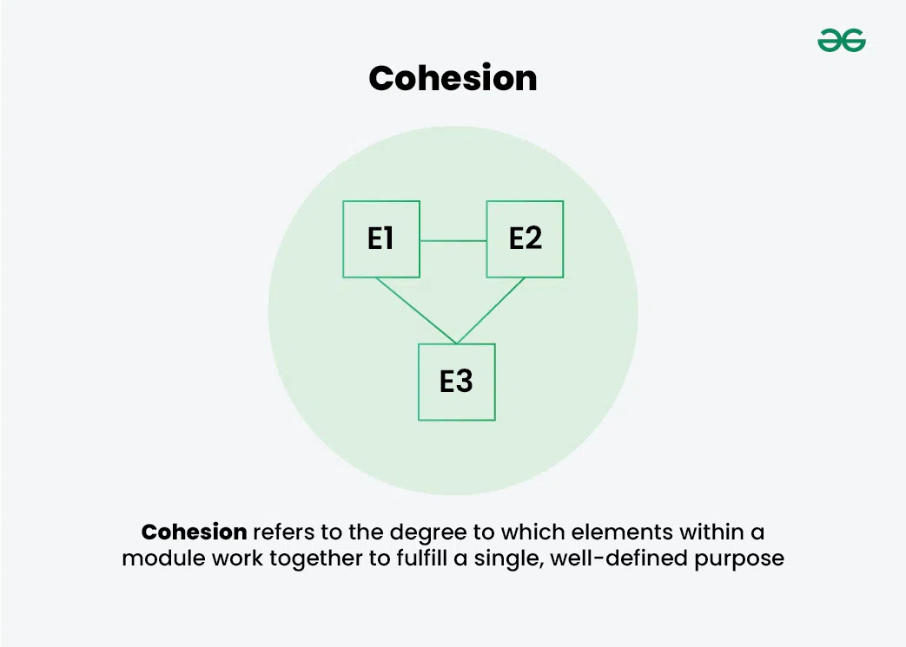

# Koppeling en Cohesie

## Koppeling
**Beschrijft de onderlinge afhankelijkheid tussen modules.**

Dus, 

Hoge koppeling betekent dat modules nauw verbonden zijn met andere modules. Een verandering binnen één module zal 
veel effect hebben op andere modules.

Lage koppeling betekent dat modules amper verbonden zijn met andere modules. Een verandering binnen één module zal 
weinig effect hebben op andere modules.

Van een hoger perspectief lijken modules samen te lopen, één te worden, wanneer er sprake is van hoge koppeling. Ze
werken namelijk als één geheel, niet apart.

Hoge koppeling is over het algemeen nadelig. Hierdoor komen de hoog gekoppelde modules altijd als een _package deal_. 
Veranderingen kunnen moeilijk plaatsvinden in enkel één van de hoog gekoppelde modules. 

## Cohesie
**Beschrijft in hoeverre elementen binnen een module samenwerken om één doel te behalen.**

Dus,

Hoge cohesie betekent dat elementen nauw verwant zijn. De elementen behalen samen één doel.

Lage cohesie betekent dat elementen losjes verwant zijn. De elementen behalen meerdere doelen.

## Nut
Deze twee termen zijn handig om in te kunnen schatten hoe _onderhoudbaar_, _schaalbaar_ en _betrouwbaar_ een
systeem (zal) zijn.

Echter is het wel van belang te benoemen dat dit geen _wetten_ zijn. Het is suggestief, niet definief.

## Extra
[https://www.youtube.com/watch?v=uWseUdUqM5U]

