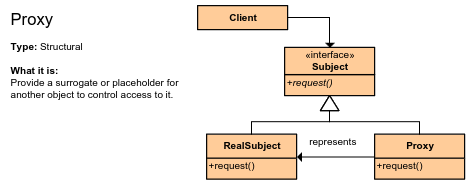
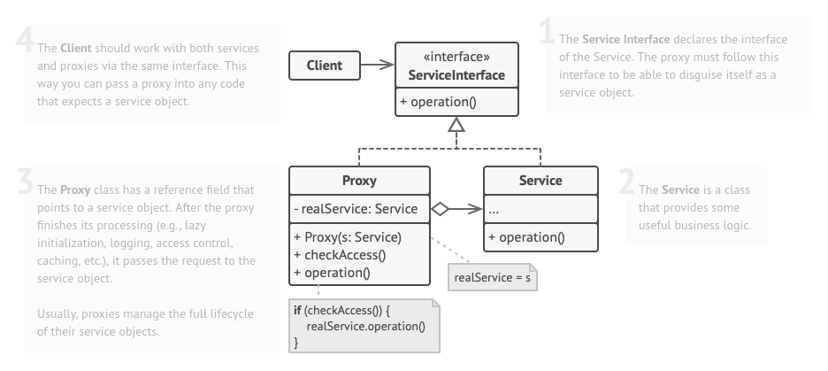

# Proxy Pattern
Design
Structural

## Welk probleem lost het op?
Men wilt informatie ophalen uit de database. Echter als men de informatie zou cachen zou dit allemaal veel sneller
kunnen zijn.

## Hoe wordt het probleem opgelost?
Waarschijnlijk heb je al een klasse die een soort database interface implementeert. Maak nog een klasse die ook deze
interface implementeert, echter maakt de proxy klasse gebruik van de al bestaande klasse. Echter cached hij nu de gegevens.
De client hoeft hier allemaal niet van te weten.

## Zijn er nadelen?
- Complexiteit stijgt