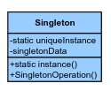
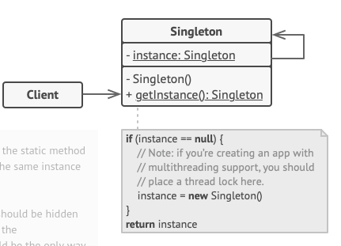

# Singleton
Design
Creational

## Welk probleem lost het op?
Er hoort altijd maar een instantie te zijn van een klasse. Daarnaast biedt het een globaal
aanknoppunt aan om die instantie te verkrijgen.

## Hoe wordt er probleem opgelost?
- Private constructor
- static instantie veld, slaat de instantie op indien deze aangemaakt is.
- static creational methode, vaak genoemd `getInstance()`

## Zijn er nadelen?
### Minder unittestbaar
De unittestbaarheid wordt verlaagt. Voor unittests horen geïsoleerd en zelfstandig uitvoerbaar
moet zijn. Dit helpt ze deterministisch te zijn (dezelfde input zorgt voor dezelfde output). Doordat een
singleton controle behoudt over zijn creatie is er sprake van een globale staat. De unittest kan daardoor
onvoorspelbaar worden. Wellicht heeft een ander stuk code de staat van de singleton al aangepast.

