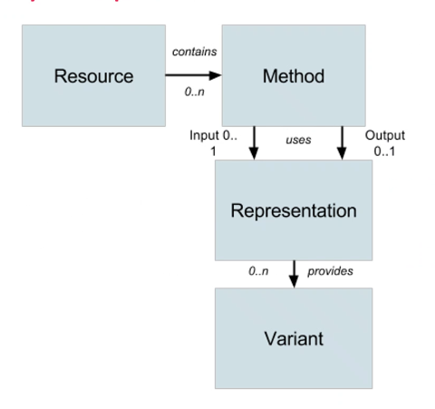

# REST

**RE**presentational **S**tate **T**ransfer

Not protocol specific, but usually used with _http_.

Stateless.

## Resource
A "thing" that is available on the internet from a URL. It has predefined methods.

## Methods
HTTP Methods:
- POST
- PUT
- PATCH
- UPDATE
- DELETE
etc.

## Representation
The format of the data exchanged. e.g:
- JSON,
- XML,
- YAML

## Variant
The content of a representation

## Addressable Resources
Every "thing" should:

### Have a URI / Endpoint
https://sales.com/customers/323421
https://sales.com/customers/32341/address

Based of the URI we know:
- How do we communicate,
- Where it is on the network
- Resource path

They are not always human-readable, but if possible why not?

### Have an ID

### Is referenceable

## Constrainted interface
Use the standard methods of the protocol: GET, POST, PUT, DELETE etc.

## Resources with multiple represetations
- Different applications need different formats
- Different platforms need different representations

## Why?
It provides a uniform interface. You know what operations the resource will support. It has predicable behavior.