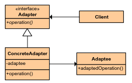
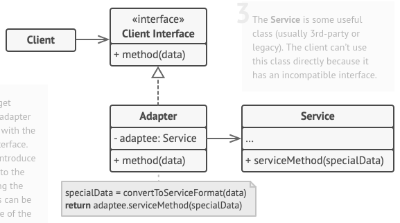

# Adapter (AKA Wrapper)
Design
Structural

## Welk probleem lost het op?
Een stuk code kan momenteel niet correct samenwerken met een ander stuk code. Over het algemeen
kan men één van de stukken niet bewerken, het is bijvoorbeeld een externe library.

## Hoe wordt het probleem opgelost?
- Een interface om de interactie, als contract, vast te leggen met de client. 
- Een Adapter klasse
  - Houdt de _incompatible_ service vast als veld.
  - Implementeert het besproken interface
    - Voor de implementatie hiervan gebruikt men de daadwerkelijk onderliggende service.

## Zijn er nadelen?
Complexiteit stijgt. Daarom is deze pattern vooral nuttig wanneer men niet bij de code kan.