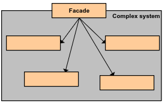
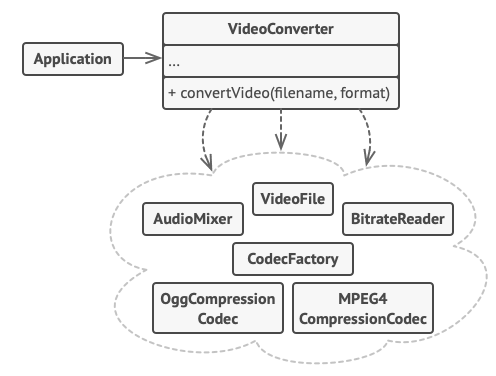

# Facade 
Design  
Structural

## Welk probleem lost het op?
Vaak om een proces te voltooien maakt de code gebruik van vele systemen om zo een doel te bereiken. Echter zorgt dit
ervoor dat al die systemen al snel hoog gekoppeld (_coupling_) raken. 

## Hoe wordt het probleem opgelost?
Maak een nieuwe klasse met een methode waar het proces achter verborgen zit. Het resultaat is een simpel interface om
met onderliggende subssytemen om te gaan. Het maakt de subsystemen normaliter makkelijker te gebruiken.

Zie het net zoals een webpage een zeer beperkte interface is om met onderliggende subsystemen om te gaan. 

## Zijn er nadelen?
Door de hoge abstractie heeft de facade wellicht maar gedeeltelijke overlap van de functionaliteit geïmplementeerd in
onderliggende subsystemen. Het is over het algemeen een beperkte interface.

## Waar lijkt het op? Wat zijn de verschillen?
### Adapter
Beide bieden een interface om gemakkelijker te werken met andere systemen. Echter is een _adapter_ meer een _translator_, hij
zorgt ervoor dat de code samen kan werken met een ander proces waar dat eerder niet kon. Een facade is bedoeld om de interactie
met complexe subsystemen te versimpelen.

### Factory
Beide bieden een interface om gemakkelijker te werken met subsystemen. De grootste dinstinctie is het idee dat een
Factory een Facade is, echter is deze dan niet een _structural_ maar _creational_. Het simplificeert niet de interacties
met een subsysteem; het simplificeert het proces van object creatie. Coördinatie vs constructie.